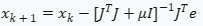
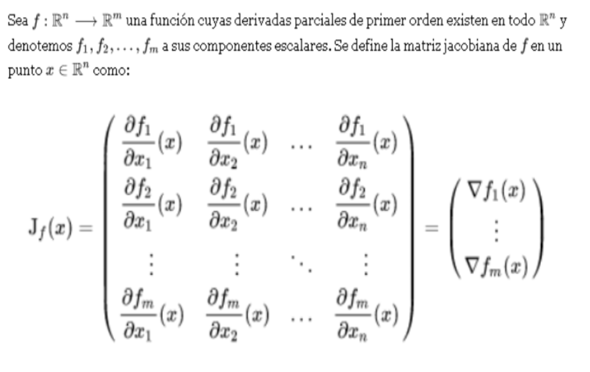
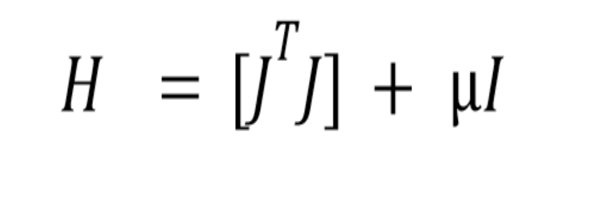
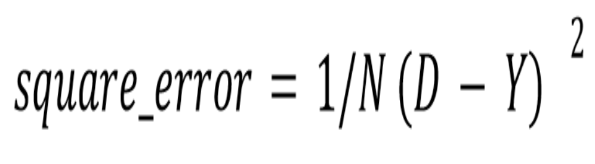

# **Red Neuronal Levenberg-Marquardt (RNLM)**

## Descripcion

Lo que se realizó fue tratar de implementar una red neuronal multicapa utilizando el algoritmo Levenberg-Marquardt para clasificación binaria. La red neuronal tiene dos entradas y una salida, lo que la hace adecuada para tareas de clasificación binaria. La función sigmoidea se utiliza como función de activación y el error cuadrático medio se emplea como función de pérdida 

## Teoria
El algoritmo Levenberg-Marquardt (LM) es un método numérico para resolver problemas de mínimos cuadrados no lineales lo que hace este metodo es una combiancion de otros dos métodos: el descenso de gradiente que es mas exacto y el método de Gauss-Newton el cual es mas rapido. Esto permite obtener soluciones numéricas para reducir problemas con funciones que a menudo son no lineales y dependen de múltiples variables. Existen argumentos para mostrar por qué algunas de estas posibilidades pueden garantizar la convergencia local del algoritmo; sin embargo, estas elecciones pueden hacer que la convergencia general del algoritmo sufra la propiedad indeseable del descenso más pronunciado, especialmente una convergencia muy lenta cerca del valor óptimo. Es por ello que el algoritmo de Levenberg-Marquardt intenta maximizar las ventajas de ambos métodos ajustando un parámetro (lamda) que determina cuándo usar un metodo y cuado usar el otro dependiendo del error cuadratico medio que nos arroje en cada iteracion.

la fórmula del algoritmo de Levenberg-Marquardt  está denotada de la siguiente manera 

### Jacobiano
La matriz Jacobiana contiene las derivadas parciales de la función objetivo con respecto a los parámetros del modelo es como un mapa que nos dice cómo se inclina la función objetivo cuando cambiamos un poquito los parámetros del modelo. Es esencial para saber en qué dirección ajustar nuestros parámetros. 

El jacobiano está descrito con la siguiente fórmula:

### Matriz Hessian

La matriz Hessiana completa puede ser costoso en términos computacionales, por lo que en el método de Levenberg-Marquardt se utiliza una aproximación de la matriz Hessiana (H) que se calcula como

Donde I es una matriz identidad por lambda (Gradiente descendiente), esta matriz nos da una idea de la curvatura de la función objetivo en el espacio de parámetros, lo que ayuda a ajustar los parámetros de una manera más efectiva.

### Error cuadratico Medio
Y luego está el error cuadrático medio, en la implementación lo calculamos de la siguiente manera:

que es básicamente una medida de qué tan mal nuestro modelo está haciendo sus predicciones en comparación con la realidad. En este algoritmo, tratamos de minimizar la suma de los cuadrados de estos errores, lo que significa mejorar la concordancia entre lo que predice nuestro modelo y lo que realmente vemos.

>[!NOTE]
>La creación de una red neuronal con el algoritmo de Levenberg-Marquardt implica varios pasos. A continuación se muestra una guía paso a paso para ayudarle a comprender cómo implementar una red neuronal con el algoritmo de Levenberg-Marquardt:

## Paso 1:
### Definir las variables

- lambda_factor = 0.1
- eta = 0.1  -> aprendizaje rate (learning rate)
- epoch = 1500  -> número de épocas (iteraciones)
- n_epoch = 0 ->  número de épocas (iteraciones) actuales (para gui)
- min_error = 0.01  -> error mínimo para parar el entrenamiento
- n_neurons = 6  -> número de neuronas en la capa oculta (hidden layer)
- w_hidden = np.matrix(np.random.rand(n_neurons, 3)) -> pesos de la capa oculta (hidden layer)
- w_output = np.random.rand(n_neurons+1) -> pesos de la capa de salida (output layer) +1 por el bias (sesgo)
- X = [] -> puntos de entrada (input) (x,y)
- d = [] -> salida deseada (desired output) (0,1) (1,0) (0,0) (1,1)
- errors = [] -> errores de cada época (iteración) (para gui)
- fig_e, ax_e = plt.subplots() -> figura y ejes para el error
- fig, ax = plt.subplots() -> figura y ejes para el gráfico
- canvas = None -> canvas para el gráfico
- canvas_e = None -> canvas para el error

## Paso 2: 
### Calcular: Si= -[H+ I]-1▽f(x1)
## Paso 3: Actualizar: 
xi+1 = xi + Si
## Paso 4: 
### Comparar: 
Si f(xi+1) < f(xi)
Entonces  i + 1 = 0.9i
Sino  i + 1 = 1.1i

## Paso 5: 
### Termina ciclo iterativo usando:
Si |f(xx + 1) - f(xi)| > 1 o ||▽f(xi)|| > 2
Entonces vuelve al paso 2
Sino ve al paso 6
## Paso 6: 
### Imprimir: 
xi + 1,f(xi +1)

## Requirimientos para compilar y correr el codigo

Python: asegúrese de tener Python instalado (versión 3.x).

Bibliotecas requeridas: Instale las bibliotecas necesarias usando lo siguiente:

    pip install numpy matplotlib

## Como correrlo

    Copie el código en un entorno Python.
    Asegúrese de que las bibliotecas necesarias estén instaladas.
    Ejecute el script.

>[!NOTE]
>Este código está diseñado con fines educativos y es posible que necesite una mayor optimización para su uso en producción.
​